# Java-DSP

[](https://github.com/gpoole/Java-DSP/actions/workflows/build-and-test.yml)
[](https://github.com/gpoole/Java-DSP/actions/workflows/release.yml)
[](./)

A professional real-time digital signal processing application for audio analysis and frequency visualization. Built with Java 25 and JavaFX, featuring an intuitive GUI and advanced signal processing capabilities.

## Features

### Core Functionality

- **Real-time Audio Capture**: Multi-device support with automatic source selection
- **FFT Analysis**: Fast Fourier Transform using Apache Commons Math (pure Java, cross-platform)
- **Frequency Visualization**: Live frequency spectrum chart with JavaFX charts featuring:
  - Normalized dB scale (peak frequency = 0 dB)
  - Gridlines for easy frequency/amplitude reading
  - Clean tick labels (e.g., "1k" instead of "1000.0")
- **Advanced Signal Processing**:
  - Hamming window function for reduced spectral leakage
  - Noise threshold filtering (3x average magnitude)
  - DC component removal
  - 5-sample frequency smoothing for stable readings
  - Configurable FFT size (16, 32, 64, 128, 256, 512, 1024, 2048, 4096, 8192, 16384, 32768, 65536 samples)
- **Cross-Platform**: Native builds for Windows, macOS (Intel & Apple Silicon), and Linux (x64 & ARM64)

### User Interface

- Modern JavaFX-based UI with native platform look and feel
- Intuitive controls with real-time status updates
- Dynamic audio device selection with automatic sample rate detection
- Responsive chart with auto-scaling axes
- Performance optimized with 50ms update throttling
- Configurable sample rates (8kHz - 48kHz)

## Quick Start

### Download Pre-built Binaries

Download the latest release for your platform from the [Releases page](https://github.com/gpoole/Java-DSP/releases):

| Platform | Download |
| -------- | -------- |
| **Windows** (x64) | `java-dsp-{version}-windows.jar` |
| **macOS** (Apple Silicon) | `java-dsp-{version}-macos.jar` |
| **Linux** (x64) | `java-dsp-{version}-linux.jar` |

### Requirements

- **Java 25** or higher
- Audio input device (microphone)

### Running the Application

```bash
java -jar java-dsp-{version}-{platform}.jar
```

Or run directly with Maven:

```bash
mvn javafx:run
```

## Building from Source

### Prerequisites

- **Java 25** or higher
- **Maven 3.6+**
- Platform-specific JavaFX SDK (optional, Maven will download automatically)

### Build

```bash
# Clone repository
git clone https://github.com/gpoole/Java-DSP.git
cd Java-DSP

# Build for current platform
mvn clean package

# Build for specific platform (CI/CD)
mvn clean package -Djavafx.platform=linux        # Linux x64
mvn clean package -Djavafx.platform=linux-aarch64  # Linux ARM64
mvn clean package -Djavafx.platform=mac          # macOS Intel
mvn clean package -Djavafx.platform=mac-aarch64  # macOS Apple Silicon
mvn clean package -Djavafx.platform=win          # Windows x64
```

### Run Tests

```bash
mvn test
```

Tests are skipped on headless CI environments for JavaFX-dependent components.

### Generate Code Coverage Report

```bash
mvn clean test jacoco:report
# Report: target/site/jacoco/index.html
```

## Usage

1. **Select Audio Source**: Choose your microphone from the dropdown menu
2. **Configure Settings**:
   - Select sample rate (recommended: 48000 Hz)
   - Choose FFT size (recommended: 2048 for balanced resolution/performance)
3. **Start Capture**: Click "Start Capture" to begin real-time analysis
4. **View Results**: Watch the frequency spectrum update in real-time
5. **Stop Capture**: Click "Stop" when finished

## Technical Details

### Signal Processing Pipeline

```mermaid
flowchart LR
    A[Audio Input] --> B[Stereo to Mono]
    B --> C[Hamming Window]
    C --> D[FFT]
    D --> E[Magnitude Calculation]
    E --> F[Noise Filtering]
    F --> G[DC Removal]
    G --> H[Frequency Smoothing]
    H --> I[Normalized dB Scale]
    I --> J[Visualization]

    style A fill:#e1f5fe
    style D fill:#fff3e0
    style J fill:#e8f5e9
```



### Key Components

- **GUIFX.java**: Main JavaFX application window with audio capture and control logic
- **XYLineChart.java**: JavaFX chart component with update throttling, thread safety, gridlines, and normalized dB display
- **signal.DSP**: Static utility class for FFT, power spectra, and frequency detection
- **signal.SignalPipeline**: Fluent builder API for chaining DSP operations
- **signal.WindowFunction**: Enum of standard window functions (Hamming, Hanning, Blackman, Flat-top)
- **util.Preconditions**: Shared input-validation utility for fail-fast error reporting
- **FFT Processing**: Apache Commons Math FastFourierTransformer
- **Audio API**: javax.sound.sampled for cross-platform audio capture

### Programmatic DSP API

Use the signal-processing classes directly, without the GUI:

```java
import com.gpoole.dsp.signal.*;

// One-shot: detect the dominant frequency of an audio buffer
double freq = DSP.dominantFrequency(samples, 48_000);

// Pipeline: chain window → DC removal → power spectrum
double[] spectrum = SignalPipeline.of(samples, 48_000)
        .window(WindowFunction.HAMMING)
        .removeDC()
        .executeToPowerSpectrumDB(0.776);

// Available windows: RECTANGULAR, HAMMING, HANNING, BLACKMAN, FLAT_TOP
double[] coefficients = WindowFunction.BLACKMAN.getCoefficients(1024);
```

### Dependencies

| Library | Version | Purpose |
| ------- | ------- | ------- |
| Apache Commons Math | 3.6.1 | FFT computation |
| JavaFX | 20.0.2 | Modern UI framework |
| Apache Commons Lang3 | 3.20.0 | Utility functions |
| Guava | 33.4.7 | Additional utilities |
| JUnit Jupiter | 5.12.2 | Unit testing |

## CI/CD Pipeline

This project uses GitHub Actions for automated building, testing, and releases:

- **Build and Test**: Runs on every push/PR across Windows, macOS, and Linux
- **CodeQL Analysis**: Automated security vulnerability scanning
- **Release**: Automated releases on version tags (v*), building platform-specific JARs

### Creating a Release

```bash
git tag -a v1.0.0 -m "Release version 1.0.0"
git push origin v1.0.0
```

This automatically triggers the release workflow, building artifacts for all platforms.

## Project Structure

```text
Java-DSP/
├── src/
│   ├── main/java/com/gpoole/dsp/
│   │   ├── GUIFX.java                    # Main JavaFX application
│   │   ├── XYLineChart.java              # JavaFX chart component
│   │   ├── signal/
│   │   │   ├── DSP.java                  # Static DSP helpers (FFT, spectra)
│   │   │   ├── SignalPipeline.java       # Fluent pipeline builder
│   │   │   └── WindowFunction.java       # Window function enum
│   │   └── util/
│   │       └── Preconditions.java        # Input validation
│   └── test/java/com/gpoole/dsp/
│       ├── FFTProcessingTest.java
│       ├── AudioFormatTest.java
│       ├── XYLineChartTest.java
│       ├── signal/
│       │   ├── DSPTest.java
│       │   ├── SignalPipelineTest.java
│       │   └── WindowFunctionTest.java
│       └── util/
│           └── PreconditionsTest.java
├── .github/workflows/
│   ├── build-and-test.yml        # CI pipeline
│   ├── release.yml               # Release automation
│   └── codeql.yml                # Security scanning
├── pom.xml
├── README.md
├── CHANGELOG.md
└── CONTRIBUTING.md
```

## Troubleshooting

### No audio devices detected

- Ensure your microphone is connected and enabled in system settings
- Check system permissions for microphone access
- Try running with administrator/sudo privileges

### JavaFX runtime not found

- The release JARs include all JavaFX dependencies
- For development, use `mvn javafx:run` which handles module paths automatically

### Native access warnings on startup

- These are harmless warnings from JavaFX accessing native libraries
- To suppress, the application runs with `--enable-native-access=javafx.graphics`

### Poor frequency detection

- Increase FFT size for better resolution
- Ensure adequate signal strength (speak/whistle loudly)
- Try different sample rates
- Check for background noise

### Performance issues

- Reduce FFT size (e.g., 1024 instead of 4096)
- Lower sample rate
- Close other audio applications

## Contributing

Contributions are welcome! Please see [CONTRIBUTING.md](CONTRIBUTING.md) for guidelines.

## Changelog

See [CHANGELOG.md](CHANGELOG.md) for version history.

## License

This project is licensed under the MIT License - see the LICENSE file for details.

## Acknowledgments

- Apache Commons Math for robust FFT implementation
- JavaFX for modern cross-platform UI
- Java Sound API for cross-platform audio support
